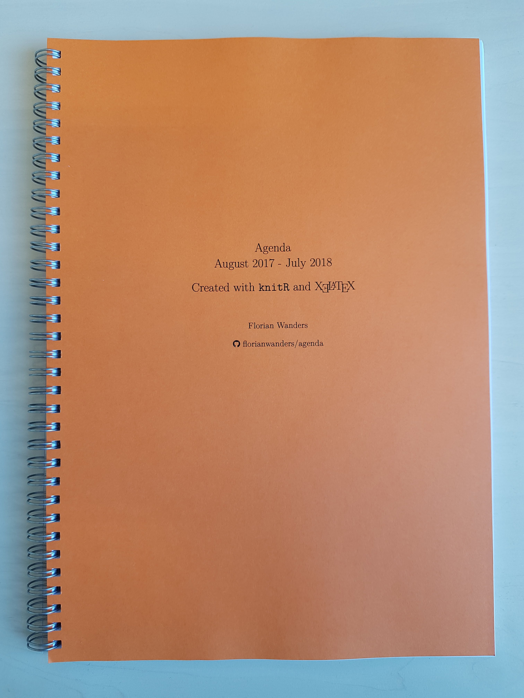

# Custom Paper Agenda

I could not find the agenda that I wanted, so I decided to knit one. 
Can be printed and bound for ca. 12&#8364; at any good (online) copy-shop.

 |  
:---------------------------------------------------------------------:|:-------------------------------------------------------:
 				   |     

## Features

- A4 agenda.[1](#flexibility)
- One week on two pages.
- Monthly overview with week numbers and highlighted weekends.
- Monthly overview can be viewed at the back of the agenda **without opening the agenda** (choose a transparent foil when printing).
- Monthly overview stays **up to date** by tearing outdated overview pages.
- Soft cover (when printed at a copy shop).

Search for "Customizable input" in `calendarMaster.Rnw` to

- enter a date at which the agenda should start (can be literally any date)
- specify how many monthly overview sheets you would like 
- enter the first and last hour you would like to see in the weekly agenda

[Preview the agenda](https://github.com/FlorianWanders/agenda/blob/master/calendarMaster.pdf)

## Set-Up

1. Download or clone this repository.
2. In [R-Studio](https://www.rstudio.com/products/rstudio/download/#download), set the `Sweave Options` (under `Global Options`) to `XeLaTeX`. 
Then knit `calendarMaster.Rnw` to create the agenda.

<a name="flexibility">1</a>: All relevant heights/widths are relative, so if you want to change the format, the agenda should still be displayed correctly. 

